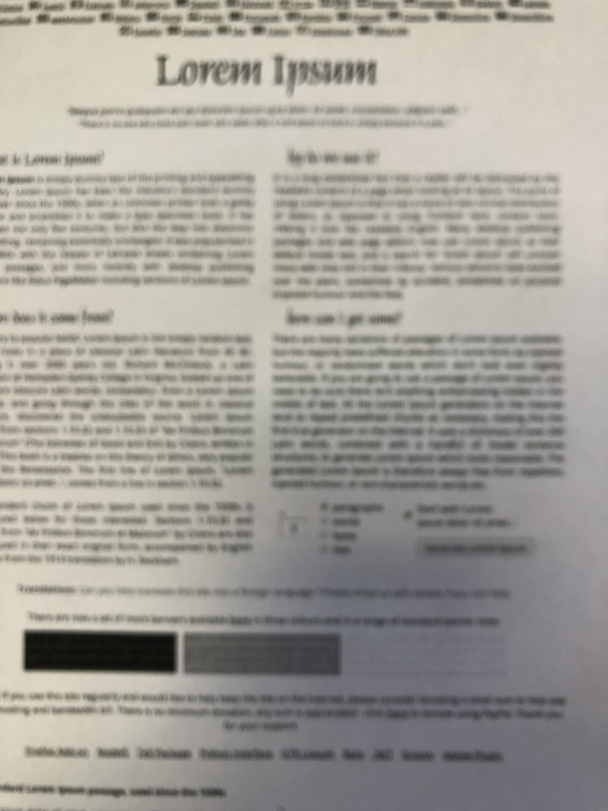
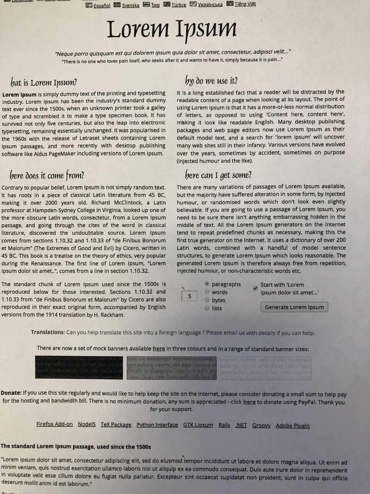

# Image_Enhancement
This project focus on image enhancement from blurred to sharp images. 

Model.h5 and logs folder are automatically created once you run train_model.py

DISCRIPTION -->

It Provides better quality image by removing blur effect in input images.
Model to be included in your ML or DL project if your dataset has blurred images and you don't want them.
Also, can be used by general public to enhance image quality

Example -->

blurred image:

sharpned image:

Use instruction -->
first run generate_data.py to generate the dataset for training, the generated data will be saved in a saperate folder named np_folder.
the train_model.py file contains the main program to train and save the model.
you will require the libraries like tensorflow, keras, imutils, scikit-image, numpy, matplotlib and tqmd in your python environment.
now ince all the environment is set run the trainmodel.py file in this folder and it will start to convert/preprocess the images and train the proposed network, here we are using "attention inverted-u" network, but can also copy the models from other folders and use them here.
the model will take a long time approc 2-3 hours to train in GTX-1050Ti 4GB RAM GPU.
once the Model is trained.
Run the test_model.py script to test the model file and check the accuracy.

PS: Some image processing is needed to be done in the output of the model in the test_model.py file which will be updated in future version of this test_model.py file.  needed some finishing touch
